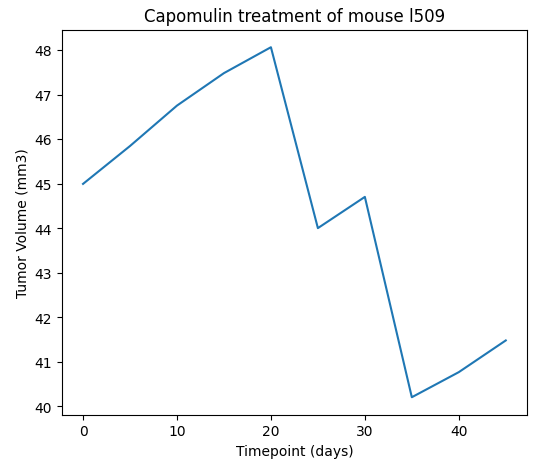

# Pymaceuticals_Inc_C5
Matplotlib Challenge (Challenge 5)

We were tasked with analyzing the data on the impact of anti-cancer medications on the volume of squamous cell carcinoma in mice over a 45 day period.

Provided are the tables and figures needed for the technical report of this analysis.

## Summary Statistics

In the analysis, Capomulin and Ramicare had over 200 observed data points, with the rest of the drug regimens around 180 observed data points, except for Propriva with only about 150 observed data points. In testing the 10 drugs, Ketapril and Naftisol had the highest tumor volume, but also the most variability as indicated in the table above. Additionally, the samples were split with slightly more observed data points of male mice compared to female as indicated in the pie graph below.

## Drug Comparison

We were tasked with looking at the final tumor volume for the following drug regimens: Capomulin, Ramicane, Infubinol, and Ceftamin. In exploring this analysis, it is clear Capomulin and Ramicane have much lower final tumor volume than Infubinol and Ceftamin. This may be indicative of these drugs working better to reduce the volume of the tumor in the mice samples observed. You can also see one outlier for the Infubinol which was extremely low. This may indicate the Infubinol does work to reduce the tumor volume, but it needs to be specific mice in which this occurs.

### Individual Mouse Analysis

Provided above is an example to track the volume of the tumor over time for a specific drug regimen (Capomulin) and mouse (l509). A dynamic analysis can be provided to allow you to explore for any drug and mouse combination upon request.

### Weight (Mass) Does Matter

In performing analysis on the average tumor volume (in cubic millimeters) and the mass (in grams) of the mouse, there appears to be a direct correlation as mass increases, the average tumor volume increases. The correlation between mouse weight (mass) and the average tumor volume is 0.84. This makes sense as the larger the mouse, the larger the tumor. 

### Sources
Data generated by MockarooLinks to an external site., LLC (2022). Realistic Data Generator.
